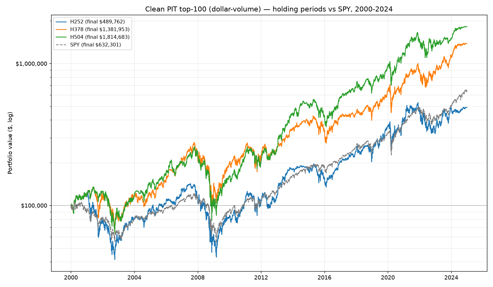

# Clean point-in-time backtest — S&P 500, 2000-2024

Window **2000-01-03..2024-12-31** (6289 trading days, ~25.0y). Start $100,000.

**Universe (clean):** PIT S&P 500 membership (incl. delisted), ranked each quarter by trailing 63-day median dollar-volume, top 100. No survivorship bias, no lookahead.

**Signal:** recovery composite >= 0.60, **no fundamental gate** (pure price signal). **Sizing:** V1 — 10%/signal, max 10, no stop-loss. Late signals that cannot complete the hold are excluded.

## Summary

| Metric | H252 | H378 | H504 | SPY |
|---|--:|--:|--:|--:|
| Final value | $489,762 | $1,381,953 | $1,814,683 | $632,301 |
| Total return | +389.8% | +1282.0% | +1714.7% | +532.3% |
| CAGR | +6.6% | +11.1% | +12.3% | +7.7% |
| Sharpe | 0.37 | 0.52 | 0.58 | 0.48 |
| Max drawdown | -69.7% | -66.7% | -69.8% | -55.2% |
| Avg trade | +11.9% | +25.3% | +34.3% | — |
| Median trade | +8.2% | +13.1% | +15.9% | — |
| Win rate | 57% | 63% | 65% | — |
| Trades | 217 | 154 | 114 | — |
| Excluded (late) | 121 | 180 | 287 | — |

## Return distribution by holding bucket (share of trades)

| Bucket | H252 | H378 | H504 |
|---|--:|--:|--:|
| < -20% | 22% | 21% | 21% |
| -20..0% | 21% | 16% | 14% |
| 0..20% | 21% | 19% | 19% |
| 20..50% | 21% | 14% | 17% |
| 50..100% | 13% | 16% | 14% |
| >100% | 2% | 14% | 15% |

## Interpretation (bias-free, ~25 years)

**The holding-period effect is real and robust.** Every metric improves monotonically with hold length — CAGR +6.6% -> +11.1% -> +12.3%, win rate 57% -> 63% -> 65%, and the fat right tail (>100% trades) 2% -> 14% -> 15%. On 217/154/114 trades over ~25 years (vs 31/23/21 in the biased 2018-2024 study), the 'let recoveries run past a year' thesis holds up.

**But the edge over SPY is far smaller than the biased test implied.** The 1-year hold (H252, +6.6% CAGR) actually **loses to SPY** (+7.7%); only the longer holds beat it (H378 +11.1%, H504 +12.3%). The earlier 50-stock 2018-2024 test showed every variant crushing SPY — that was the survivorship/selection bias talking.

**Tail risk is severe.** Max drawdowns of -70%..-70% (vs SPY -55%) — a concentrated, no-stop, dip-buying book got destroyed in 2002 and 2008-09 (visible in the chart). The 2018-2024 window never contained a 2008, so it reported ~-32% and hid this.

### Data caveats
- **Size proxy:** ranked by dollar-volume, not exact market cap (unavailable free pre-2015). Highly correlated for mega-caps, not identical.
- **No fundamental gate:** pure price signal, so no quality filter (the gate needs EDGAR data that would re-introduce survivorship bias over 25y).
- **Fetch coverage:** 1054/1090 ever-members fetched (96.7%). Facebook was recovered by aliasing FB->META. The ~36 missing are mostly bankruptcies/acquisitions with no free continuing series (LEHMQ, RSHCQ, AAMRQ, APC, CAM, PCL...). Note some are bankruptcies that would have been big *losers* had the dip signal fired on them — so their absence may slightly *flatter* results.
