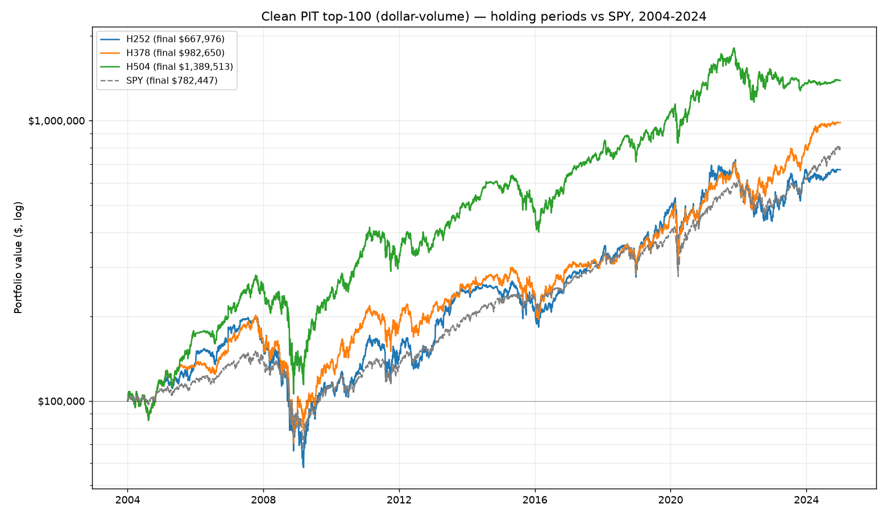

# Clean point-in-time backtest — S&P 500, 2004-2024

Window **2004-01-02..2024-12-31** (5285 trading days, ~21.0y). Start $100,000.

**Universe (clean):** PIT S&P 500 membership (incl. delisted), ranked each quarter by trailing 63-day median dollar-volume, top 100. No survivorship bias, no lookahead.

**Signal:** recovery composite >= 0.60, **no fundamental gate** (pure price signal). **Sizing:** V1 — 10%/signal, max 10, no stop-loss. Late signals that cannot complete the hold are excluded.

## Summary

| Metric | H252 | H378 | H504 | SPY |
|---|--:|--:|--:|--:|
| Final value | $667,976 | $982,650 | $1,389,513 | $782,447 |
| Total return | +568.0% | +882.7% | +1289.5% | +682.4% |
| CAGR | +9.5% | +11.5% | +13.4% | +10.3% |
| Sharpe | 0.47 | 0.56 | 0.64 | 0.62 |
| Max drawdown | -70.9% | -65.0% | -62.3% | -55.2% |
| Avg trade | +15.4% | +24.8% | +37.6% | — |
| Median trade | +11.4% | +8.0% | +18.0% | — |
| Win rate | 58% | 61% | 63% | — |
| Trades | 179 | 127 | 94 | — |
| Excluded (late) | 121 | 180 | 287 | — |

## Return distribution by holding bucket (share of trades)

| Bucket | H252 | H378 | H504 |
|---|--:|--:|--:|
| < -20% | 20% | 21% | 17% |
| -20..0% | 23% | 18% | 20% |
| 0..20% | 20% | 20% | 14% |
| 20..50% | 22% | 11% | 18% |
| 50..100% | 12% | 17% | 15% |
| >100% | 3% | 12% | 16% |

## Interpretation (bias-free, ~21 years)

**The holding-period effect is real and robust.** Every metric improves monotonically with hold length — CAGR +9.5% -> +11.5% -> +13.4%, win rate 58% -> 61% -> 63%, and the fat right tail (>100% trades) 3% -> 12% -> 16%. On 179/127/94 trades over ~21 years (vs 31/23/21 in the biased 2018-2024 study), the 'let recoveries run past a year' thesis holds up.

**But the edge over SPY is far smaller than the biased test implied.** The 1-year hold (H252, +9.5% CAGR) actually **loses to SPY** (+10.3%); only the longer holds beat it (H378 +11.5%, H504 +13.4%). The earlier 50-stock 2018-2024 test showed every variant crushing SPY — that was the survivorship/selection bias talking.

**Tail risk is severe.** Max drawdowns of -71%..-62% (vs SPY -55%) — a concentrated, no-stop, dip-buying book got destroyed in 2008-09 (visible in the chart). The 2018-2024 window never contained a 2008, so it reported ~-32% and hid this.

### Data caveats
- **Size proxy:** ranked by dollar-volume, not exact market cap (unavailable free pre-2015). Highly correlated for mega-caps, not identical.
- **No fundamental gate:** pure price signal, so no quality filter (the gate needs EDGAR data that would re-introduce survivorship bias over 25y).
- **Fetch coverage:** 1054/1090 ever-members fetched (96.7%). Facebook was recovered by aliasing FB->META. The ~36 missing are mostly bankruptcies/acquisitions with no free continuing series (LEHMQ, RSHCQ, AAMRQ, APC, CAM, PCL...). Note some are bankruptcies that would have been big *losers* had the dip signal fired on them — so their absence may slightly *flatter* results.
