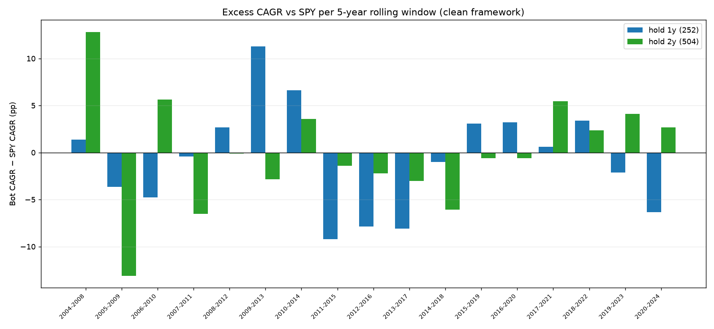

# Rolling-window robustness — clean framework

Fixed-length windows stepped one year across 2004-2024. Each window is a self-contained clean backtest (PIT dollar-volume top-100, pure signal, V1 sizing, next-session fills, completion rule) vs SPY over the same window. Research engine.

## 5-year rolling windows

### hold = 252 (1y)  —  **beat SPY in 8/17 windows**, median excess -0.4%, worst -9.2%, best +11.3%

| window | bot CAGR | SPY CAGR | excess | MaxDD | beat |
|---|--:|--:|--:|--:|:--|
| 2004-2008 | -0.9% | -2.2% | +1.4% | -47% | ✅ |
| 2005-2009 | -3.2% | +0.5% | -3.7% | -71% | ❌ |
| 2006-2010 | -2.9% | +1.9% | -4.8% | -71% | ❌ |
| 2007-2011 | -0.7% | -0.3% | -0.4% | -66% | ❌ |
| 2008-2012 | +4.5% | +1.8% | +2.7% | -58% | ✅ |
| 2009-2013 | +28.5% | +17.2% | +11.3% | -31% | ✅ |
| 2010-2014 | +21.6% | +15.0% | +6.6% | -27% | ✅ |
| 2011-2015 | +3.0% | +12.2% | -9.2% | -31% | ❌ |
| 2012-2016 | +6.4% | +14.2% | -7.9% | -31% | ❌ |
| 2013-2017 | +7.0% | +15.1% | -8.1% | -31% | ❌ |
| 2014-2018 | +7.6% | +8.6% | -1.0% | -31% | ❌ |
| 2015-2019 | +14.6% | +11.6% | +3.1% | -36% | ✅ |
| 2016-2020 | +18.7% | +15.5% | +3.2% | -34% | ✅ |
| 2017-2021 | +18.8% | +18.2% | +0.6% | -37% | ✅ |
| 2018-2022 | +12.6% | +9.2% | +3.4% | -35% | ✅ |
| 2019-2023 | +13.5% | +15.6% | -2.1% | -41% | ❌ |
| 2020-2024 | +7.9% | +14.3% | -6.3% | -41% | ❌ |

### hold = 504 (2y)  —  **beat SPY in 7/17 windows**, median excess -0.6%, worst -13.1%, best +12.8%

| window | bot CAGR | SPY CAGR | excess | MaxDD | beat |
|---|--:|--:|--:|--:|:--|
| 2004-2008 | +10.6% | -2.2% | +12.8% | -27% | ✅ |
| 2005-2009 | -12.6% | +0.5% | -13.1% | -73% | ❌ |
| 2006-2010 | +7.5% | +1.9% | +5.6% | -62% | ✅ |
| 2007-2011 | -6.8% | -0.3% | -6.5% | -68% | ❌ |
| 2008-2012 | +1.8% | +1.8% | -0.1% | -59% | ❌ |
| 2009-2013 | +14.3% | +17.2% | -2.9% | -31% | ❌ |
| 2010-2014 | +18.5% | +15.0% | +3.6% | -31% | ✅ |
| 2011-2015 | +10.8% | +12.2% | -1.4% | -31% | ❌ |
| 2012-2016 | +12.0% | +14.2% | -2.2% | -24% | ❌ |
| 2013-2017 | +12.1% | +15.1% | -3.0% | -38% | ❌ |
| 2014-2018 | +2.5% | +8.6% | -6.1% | -39% | ❌ |
| 2015-2019 | +11.0% | +11.6% | -0.6% | -37% | ❌ |
| 2016-2020 | +14.9% | +15.5% | -0.6% | -29% | ❌ |
| 2017-2021 | +23.6% | +18.2% | +5.4% | -32% | ✅ |
| 2018-2022 | +11.5% | +9.2% | +2.3% | -41% | ✅ |
| 2019-2023 | +19.7% | +15.6% | +4.1% | -38% | ✅ |
| 2020-2024 | +16.9% | +14.3% | +2.7% | -36% | ✅ |

## 7-year rolling windows

### hold = 252 (1y)  —  **beat SPY in 6/15 windows**, median excess -0.8%, worst -6.9%, best +3.3%

| window | bot CAGR | SPY CAGR | excess | MaxDD | beat |
|---|--:|--:|--:|--:|:--|
| 2004-2010 | +1.5% | +3.8% | -2.4% | -70% | ❌ |
| 2005-2011 | +3.3% | +2.7% | +0.6% | -71% | ✅ |
| 2006-2012 | +0.2% | +3.8% | -3.6% | -71% | ❌ |
| 2007-2013 | +5.5% | +6.1% | -0.6% | -66% | ❌ |
| 2008-2014 | +8.4% | +7.4% | +1.0% | -58% | ✅ |
| 2009-2015 | +17.3% | +14.2% | +3.1% | -31% | ✅ |
| 2010-2016 | +14.3% | +12.5% | +1.8% | -31% | ✅ |
| 2011-2017 | +6.6% | +13.5% | -6.9% | -31% | ❌ |
| 2012-2018 | +10.3% | +12.3% | -2.1% | -31% | ❌ |
| 2013-2019 | +11.3% | +14.2% | -2.9% | -31% | ❌ |
| 2014-2020 | +10.7% | +12.9% | -2.2% | -34% | ❌ |
| 2015-2021 | +17.2% | +14.8% | +2.4% | -37% | ✅ |
| 2016-2022 | +15.0% | +11.6% | +3.3% | -37% | ✅ |
| 2017-2023 | +12.4% | +13.2% | -0.8% | -43% | ❌ |
| 2018-2024 | +11.2% | +13.6% | -2.4% | -41% | ❌ |

### hold = 504 (2y)  —  **beat SPY in 10/15 windows**, median excess +0.8%, worst -7.4%, best +6.0%

| window | bot CAGR | SPY CAGR | excess | MaxDD | beat |
|---|--:|--:|--:|--:|:--|
| 2004-2010 | +5.3% | +3.8% | +1.5% | -66% | ✅ |
| 2005-2011 | -1.3% | +2.7% | -3.9% | -73% | ❌ |
| 2006-2012 | +9.9% | +3.8% | +6.0% | -62% | ✅ |
| 2007-2013 | -1.3% | +6.1% | -7.4% | -68% | ❌ |
| 2008-2014 | +8.5% | +7.4% | +1.1% | -59% | ✅ |
| 2009-2015 | +15.0% | +14.2% | +0.8% | -31% | ✅ |
| 2010-2016 | +12.9% | +12.5% | +0.5% | -31% | ✅ |
| 2011-2017 | +10.5% | +13.5% | -3.0% | -31% | ❌ |
| 2012-2018 | +10.5% | +12.3% | -1.8% | -39% | ❌ |
| 2013-2019 | +14.2% | +14.2% | +0.0% | -38% | ✅ |
| 2014-2020 | +7.2% | +12.9% | -5.7% | -39% | ❌ |
| 2015-2021 | +18.9% | +14.8% | +4.0% | -37% | ✅ |
| 2016-2022 | +15.5% | +11.6% | +3.9% | -43% | ✅ |
| 2017-2023 | +14.7% | +13.2% | +1.5% | -35% | ✅ |
| 2018-2024 | +18.1% | +13.6% | +4.5% | -41% | ✅ |

## Verdict — the edge is NOT stable; it is regime-dependent

- Beat-rate vs SPY across rolling windows: 8/17 (5y, hold 1y), 7/17 (5y, hold 2y), 10/15 (7y, hold 2y); median 5y excess -0.4% (1y) / -0.6% (2y). That is a coin flip, not a persistent edge.

- **Where it wins and loses (5y windows):** best window 2009-2013 +11.3% (hold 1y) / 2004-2008 +12.8% (hold 2y); worst 2011-2015 -9.2% (hold 1y) / 2005-2009 -13.1% (hold 2y). The wins sit in windows that contain a major dislocation the signal can dip-buy; the losses are steady bull markets with no deep dips. A full-period 'beats SPY' result therefore depends on where the clock starts.

- **Implication for a real investor:** whether you beat the index depends on whether your holding window happens to contain a crash you can recover from — timing you cannot control. This is crisis alpha, not a reliable index-beating machine.
