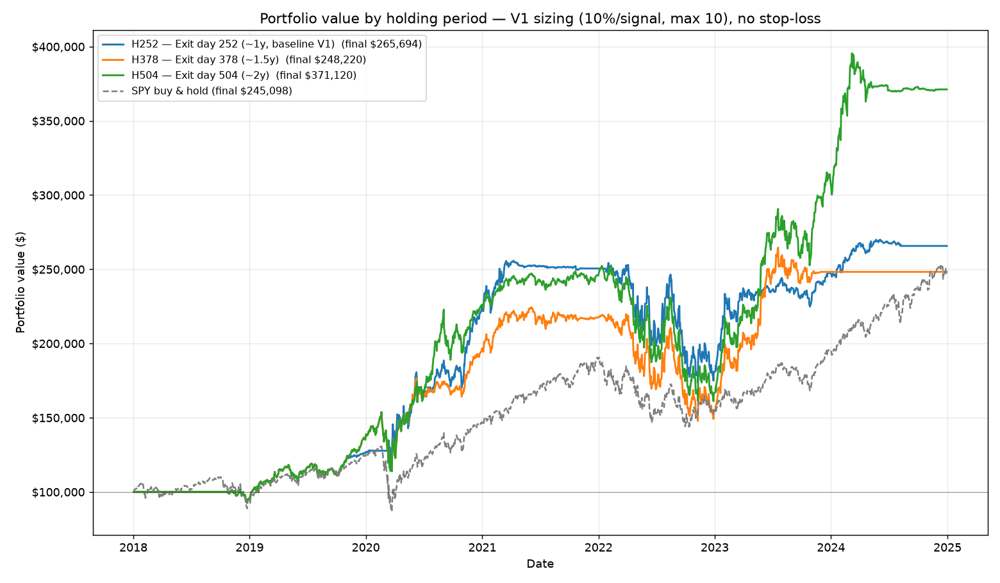

# Holding-Period Comparison vs Baseline V1

Window: **2018-01-02 – 2024-12-30** (1760 trading days, ~7.0y). Start capital $100,000.

Fixed across all variants: same universe, same composite BUY threshold, V1 sizing (**10%/signal, max 10 concurrent, no stop-loss**). Only the holding period changes.

Completion rule: a signal is taken only if the full hold fits inside the data window; late-2024 signals that cannot complete the horizon are **excluded** from that variant (not marked-to-market, no assumed return).

## 1. Summary metrics

| Metric | H252 (baseline) | H378 (~1.5y) | H504 (~2y) | SPY B&H |
|---|--:|--:|--:|--:|
| Final value | $265,694 | $248,220 | $371,120 | $245,098 |
| Total return | +165.7% | +148.2% | +271.1% | +145.1% |
| CAGR | +15.0% | +13.9% | +20.6% | +13.7% |
| Sharpe (rf=0) | 0.80 | 0.70 | 0.92 | 0.76 |
| Max drawdown | -32.2% | -34.1% | -36.2% | -33.7% |
| Avg trade return | +42.5% | +56.1% | +97.6% | — |
| Median trade return | +32.7% | +36.4% | +72.3% | — |
| Win rate | 68% | 78% | 81% | — |
| Trades (completed) | 31 | 23 | 21 | — |

## 2. Sample bookkeeping (signals excluded for not completing the horizon)

| Variant | Completed trades | Excluded (late, can't complete) | Skipped (capacity) | Skipped (re-entry) |
|---|--:|--:|--:|--:|
| H252 | 31 | 16 | 61 | 244 |
| H378 | 23 | 28 | 83 | 218 |
| H504 | 21 | 63 | 72 | 196 |

As the horizon lengthens, the no-new-entry cutoff moves earlier, so more late signals are dropped — by design, to avoid scoring incomplete trades.

## 3. Per-trade return distribution (does the upper tail grow with hold time?)

### Percentiles of trade return

| Pctile | H252 | H378 | H504 |
|---|--:|--:|--:|
| min | -31.3% | -23.3% | -30.1% |
| p10 | -17.5% | -6.1% | -23.1% |
| p25 | -7.8% | +4.2% | +34.4% |
| median | +32.7% | +36.4% | +72.3% |
| p75 | +85.4% | +94.5% | +108.1% |
| p90 | +113.8% | +150.7% | +244.9% |
| p95 | +141.5% | +176.3% | +309.3% |
| max | +177.1% | +184.2% | +324.0% |

### Trade counts by return bucket

| Return bucket | H252 | H378 | H504 |
|---|--:|--:|--:|
| < -20% | 2 | 1 | 3 |
| -20% .. 0% | 8 | 4 | 1 |
| 0% .. +20% | 3 | 3 | 1 |
| +20% .. +50% | 7 | 5 | 2 |
| +50% .. +100% | 6 | 4 | 7 |
| > +100% | 5 | 6 | 7 |

### Share of trades by return bucket

| Return bucket | H252 | H378 | H504 |
|---|--:|--:|--:|
| < -20% | 6% | 4% | 14% |
| -20% .. 0% | 26% | 17% | 5% |
| 0% .. +20% | 10% | 13% | 5% |
| +20% .. +50% | 23% | 22% | 10% |
| +50% .. +100% | 19% | 17% | 33% |
| > +100% | 16% | 26% | 33% |

## 4. Interpretation

**The upper tail clearly grows with holding time.** The share of trades returning >+100% rises 16% → 26% → 33% (H252→H378→H504), and the 90th percentile trade goes +114% → +151% → +245%. Win rate (68% → 78% → 81%) and median trade (+33% → +36% → +72%) also rise monotonically. For a recovery/dip strategy on quality names, holding longer lets the recoveries compound instead of being cut at 12 months.

**On H252 vs the published baseline V1.** The headline V1 report marks the few late-2024 positions to market and prints a final value of ~$294,708. Here, for an apples-to-apples three-way comparison, those same un-completable trades are *excluded* under the completion rule, so H252 prints $265,694. The engine, sizing, threshold and signals are otherwise identical — the gap is purely the 16 excluded late trades, not a methodology change in the signal.

**Caveat on H504.** Its higher CAGR/Sharpe is real in-sample but rests on a thin, survivorship-shaped set: only 21 completed trades, with the no-new-entry cutoff falling around end-2022, so almost all of its trades are the strong 2020–2022 recovery cohort and a large cash balance sits idle through 2023–2024 (visible as the flat green tail). Read the H504 edge as suggestive of a real 'let winners run' effect, not as a robust standalone CAGR estimate — the longer the horizon, the fewer independent trades remain to test it on.
