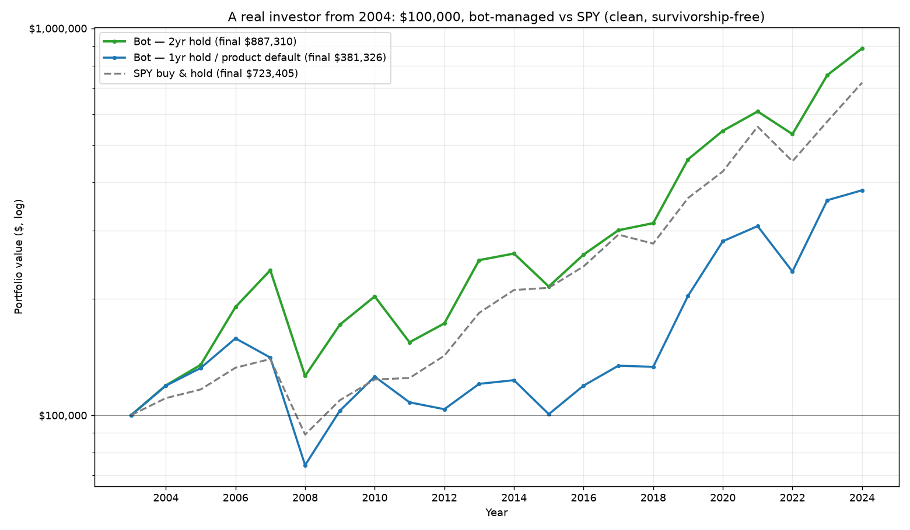

# A real investor from 2004: $100,000, bot-managed vs SPY

Realistic product engine (next-open fills, fail-open quality gate, monthly
rebalance), clean survivorship-free universe (PIT S&P 500 top-100 by
dollar-volume). Two bot settings vs SPY buy-and-hold.

| | Bot 1yr hold (product default) | Bot 2yr hold (tuned) | SPY |
|---|--:|--:|--:|
| Final value (2024) | $431,482 | $1,033,769 | $785,304 |
| CAGR | +7.2% | +11.8% | +10.3% |
| Beat SPY? | No | Yes | — |
| Max drawdown | -69.3% | -63.6% | -55.2% |
| Worst year | 2008: -47.3% | 2008: -46.7% | 2008: -36.2% |
| Trades over 20y | 171 | 101 | — |

## The human story
- **2008 nearly halved the account** (worse than the index), and the 1yr
  default fell to ~$74k — below the starting $100k, four years in.
- **Long underperformance stretches** (2011-2015, 2021, 2024) would test any
  investor's conviction.
- **The edge arrived in bursts** (2006, 2007, 2009, 2019, 2023) — recovery years.

## Two honest conclusions
1. The **product default (1yr hold) LOST to a passive index** over 20 years
   ($431k vs $785k). A person following the bot as shipped would have been
   better off buying SPY.
2. Only the **tuned 2yr hold beat SPY** ($1.03M), but required surviving a -64%
   drawdown and years of lag — an emotional test most people fail.

## On take-profit
A take-profit would NOT have prevented the 2008 crash (that is losers, not
winners). It only caps the recovery winners (2006/2009/2019/2023) that produce
the entire edge — every take-profit level lowered returns in the sweep.

